# Tailor Web App: SewSuite

## About

This project is a comprehensive collaboration between Tyla Fernandez and Myles Petillo, aimed at building a robust web application for tailors and seamstresses. The goal is to streamline the process of tracking orders, managing client details, sending notifications, and handling payments—all within one intuitive platform.

Working from concept to execution, Tyla Fernandez will focus on the user experience (UX) design, front-end development, SQL database management, and prototyping in Figma. This ensures a seamless, user-friendly interface that prioritizes functionality and aesthetics for ease of use.

Myles Petillo will lead the back-end development, ensuring the app operates smoothly and efficiently behind the scenes. Together, we are committed to creating a powerful tool that helps professionals in the tailoring and sewing industry better manage their business operations, improve client communication, and simplify payments.

This collaborative project highlights both front-end and back-end expertise, working in harmony to bring a fully functional and scalable web app to life.

## Summary

This tool addresses a critical need in the tailoring and sewing industry, where many professionals still rely on manual methods to track orders, communicate with clients, and manage payments. By digitizing these processes, we're simplifying workflow management, improving client interactions, and helping users stay organized—ultimately saving time and reducing stress.

With this app, we aim to provide tailors and seamstresses with a comprehensive platform that enhances their productivity, ensures smooth communication, and integrates modern tools for better business management. It's an essential solution for professionals who want to focus more on their craft and less on the logistics.

## Goal

The goal of this app is to provide tailors and seamstresses with an all-in-one solution to manage their businesses more effectively. By streamlining order tracking, client management, communication, and payments, the app aims to reduce the time and effort spent on administrative tasks, allowing professionals to focus on their craft.

Key objectives include:
* **Simplifying workflow management** through an intuitive interface for tracking projects and deadlines.
* **Enhancing client communication** by sending automated notifications and updates via email or text.
* **Improving financial management** by integrating secure payment options for deposits and final payments.
* **Providing personalized client experiences** by allowing users to store detailed client information, measurements, and service preferences.

Ultimately, the goal is to empower tailors and seamstresses to run their businesses more efficiently, boost client satisfaction, and grow their operations with ease.

## Features

The web app includes the following main features:

1. Dashboard
2. Projects/Orders Management
3. Client Management
4. Calendar
5. Notifications
6. Payments
7. Settings

## Sitemap

Below is a sitemap showing the structure of the web app:

```mermaid
graph TD
    A[Dashboard] --> B[Projects/Orders]
    A --> C[Client Management]
    A --> D[Calendar]
    A --> E[Notifications]
    A --> F[Payments]
    A --> G[Settings]

    B --> B1[List View]
    B --> B2[Project Details]
    B --> B3[New Project]
    B --> B4[Status Updates]

    C --> C1[Client List]
    C --> C2[Client Profiles]
    C --> C3[Add New Client]

    D --> D1[Monthly/Weekly View]
    D --> D2[Schedule Appointment]
    D --> D3[Deadline Tracking]

    E --> E1[Notification Settings]
    E --> E2[Message Templates]
    E --> E3[Send Notification]

    F --> F1[Payment History]
    F --> F2[Send Invoice]
    F --> F3[Accept Payment]
    F --> F4[Payment Settings]

    G --> G1[Account Settings]
    G --> G2[Notification Preferences]
    G --> G3[Integration Settings]
```

## Technology Stack

- Frontend: [To be decided]
- Backend: [To be decided]
- Database: SQL
- Design & Prototyping: Figma

## Getting Started

[Instructions for setting up the project locally will be added here]

## User Personas

Our app is designed to cater to a variety of users in the tailoring and seamstress industry. Below is a breakdown of our primary user types and their needs:

| User | Key Needs | Challenges | Looking For |
|------|-----------|------------|-------------|
| **User 1: Professional Tailor (Small Business Owner)** | - Seamlessly track multiple ongoing projects.   - Send automatic status updates via email or text.   - Manage client expectations by tracking deadlines.   - Simple system for deposits and payments. | - Handling large volumes of orders during peak seasons.   - Keeping track of measurements and alterations.   - Avoiding late payments. | - Calendar-based view for deadlines.   - Ability to manage clients and order details.   - Payment system integration (accept deposits, track payments). |
| **User 2: Hobbyist Seamstress** | - Track personal projects and occasional custom orders.   - Organize by fabric, patterns, or due date.   - Send casual updates to friends or clients. | - Not being overly technical with the app.   - Managing small volumes of orders with varying due dates.   - Tracking expenses and profits. | - Visual dashboard for quick overview.   - Intuitive design with easy-to-understand flow.   - Optional features like pattern library or fabric tracker. |
| **User 3: Large Workshop Owner** | - Manage a team working on different parts of an order.   - Assign and track tasks across team members.   - Centralized communication and payment management. | - Clear communication between clients and team members.   - Ensuring deadlines are met across the team.   - Managing flexible payments (partial payments). | - Team management tools (assign tasks, mark progress).   - Client portal for order status.   - Payment system for partial and full payments with invoices. |
| **User 4: Mobile Tailor (Freelancer)** | - Track orders on the go.   - Mobile access for project updates and payments.   - Quick client communication (preferably text). | - Balancing clients in different locations.   - Managing payments while traveling.   - Updating orders in real-time remotely. | - Mobile-first interface with full feature access.   - Simple communication tools for fast updates.   - Mobile payment integration (Apple Pay, Google Pay). |
| **User 5: Wedding Dressmaker** | - Handle long-term projects like wedding dresses.   - Keep detailed notes on alterations and fittings.   - Send regular updates to clients and schedule fittings. | - Communicating without overwhelming clients.   - Organizing measurements, sketches, and alterations.   - Ensuring timely payments before the event date. | - Store and organize detailed project notes.   - Calendar for scheduling and client reminders.   - Secure payment gateway for deposits and final payments. |

  
These user personas guide our development process, ensuring that we create features that address the specific needs and challenges of our diverse user base.

## Contributing

This project is a collaboration between Tyla Fernandez and Myles Petillo. We are not currently accepting external contributions.

## Contact

- Tyla Fernandez: 
- Myles Petillo: 

