# Tailor Web App: SewSuite

## About

This project is a comprehensive collaboration between Tyla Fernandez and Myles Petillo, aimed at building a robust web application for tailors and seamstresses. The goal is to streamline the process of tracking orders, managing client details, sending notifications, and handling payments—all within one intuitive platform.

Working from concept to execution, Tyla Fernandez will focus on the user experience (UX) design, front-end development, SQL database management, and prototyping in Figma. This ensures a seamless, user-friendly interface that prioritizes functionality and aesthetics for ease of use.

Myles Petillo will lead the back-end development, ensuring the app operates smoothly and efficiently behind the scenes. Together, we are committed to creating a powerful tool that helps professionals in the tailoring and sewing industry better manage their business operations, improve client communication, and simplify payments.

This collaborative project highlights both front-end and back-end expertise, working in harmony to bring a fully functional and scalable web app to life.

## Summary

This tool addresses a critical need in the tailoring and sewing industry, where many professionals still rely on manual methods to track orders, communicate with clients, and manage payments. By digitizing these processes, we're simplifying workflow management, improving client interactions, and helping users stay organized—ultimately saving time and reducing stress.

With this app, we aim to provide tailors and seamstresses with a comprehensive platform that enhances their productivity, ensures smooth communication, and integrates modern tools for better business management. It's an essential solution for professionals who want to focus more on their craft and less on the logistics.

## Goal

The goal of this app is to provide tailors and seamstresses with an all-in-one solution to manage their businesses more effectively. By streamlining order tracking, client management, communication, and payments, the app aims to reduce the time and effort spent on administrative tasks, allowing professionals to focus on their craft.

Key objectives include:
* **Simplifying workflow management** through an intuitive interface for tracking projects and deadlines.
* **Enhancing client communication** by sending automated notifications and updates via email or text.
* **Improving financial management** by integrating secure payment options for deposits and final payments.
* **Providing personalized client experiences** by allowing users to store detailed client information, measurements, and service preferences.

Ultimately, the goal is to empower tailors and seamstresses to run their businesses more efficiently, boost client satisfaction, and grow their operations with ease.

## Features

The web app includes the following main features:

1. Dashboard
2. Projects/Orders Management
3. Client Management
4. Calendar
5. Notifications
6. Payments
7. Settings

## Sitemap

Below is a sitemap showing the structure of the web app:

```mermaid
graph TD
    A[Dashboard] --> B[Projects/Orders]
    A --> C[Client Management]
    A --> D[Calendar]
    A --> E[Notifications]
    A --> F[Payments]
    A --> G[Settings]

    B --> B1[List View]
    B --> B2[Project Details]
    B --> B3[New Project]
    B --> B4[Status Updates]

    C --> C1[Client List]
    C --> C2[Client Profiles]
    C --> C3[Add New Client]

    D --> D1[Monthly/Weekly View]
    D --> D2[Schedule Appointment]
    D --> D3[Deadline Tracking]

    E --> E1[Notification Settings]
    E --> E2[Message Templates]
    E --> E3[Send Notification]

    F --> F1[Payment History]
    F --> F2[Send Invoice]
    F --> F3[Accept Payment]
    F --> F4[Payment Settings]

    G --> G1[Account Settings]
    G --> G2[Notification Preferences]
    G --> G3[Integration Settings]
```

## Technology Stack

- Frontend: [To be decided]
- Backend: [To be decided]
- Database: SQL
- Design & Prototyping: Figma

## Getting Started

[Instructions for setting up the project locally will be added here]

## User Personas

Our app is designed to cater to a variety of users in the tailoring and seamstress industry. Below is a breakdown of our primary user types and their needs:

# UX Research Case Study - 5 Different Users

## 1. Professional Tailor (Small Business Owner)

### Key Needs
- Seamlessly track multiple ongoing projects
- Ability to send automatic status updates via email or text to clients
- Manage client expectations by tracking deadlines
- Simple system for taking deposits and final payments (with automated reminders)

### Challenges
- Handling large volumes of orders during peak seasons
- Keeping track of specific measurements and alterations for different clients
- Avoiding late payments from clients

### Looking For
- A calendar-based view for order deadlines
- Ability to quickly add and manage clients and order details
- Payment system integration (accept deposits and track full payments)

## 2. Hobbyist Seamstress

### Key Needs
- Track personal projects and occasional custom orders for clients
- Organize projects by fabric, patterns, or due date
- Option to send casual updates to friends or clients about order status

### Challenges
- Not being overly technical with the app
- Managing a small volume of orders with varying due dates
- Keeping track of expenses and profits

### Looking For
- Visual dashboard with a quick overview of order status
- Intuitive design with easy-to-understand project flow
- Optional features like a pattern library or fabric usage tracker

## 3. Large Workshop Owner

### Key Needs
- Manage a team of tailors working on different parts of the same order
- Assign and track tasks across team members
- Centralized client communication and payment management

### Challenges
- Keeping communication clear between clients and multiple tailors
- Ensuring deadlines are met when multiple people are working on a single project
- Managing payments with flexibility (e.g., partial payments)

### Looking For
- Team management tools within the app (assign tasks, mark progress)
- Client portal where clients can log in and check their order status
- Payment system that allows clients to make partial or full payments with invoices

## 4. Mobile Tailor (Freelancer)

### Key Needs
- Track orders while on the go
- Easy mobile access for updating project status and taking payments
- Communicate quickly with clients (text preferred)

### Challenges
- Balancing multiple clients in different locations
- Keeping on top of payments while traveling
- Updating orders in real-time while working remotely

### Looking For
- Mobile-first interface with all key features accessible
- Simple communication tools for fast texting or email updates
- Payment system with integrated mobile payment solutions (e.g., Apple Pay, Google Pay)

## 5. Wedding Dressmaker

### Key Needs
- Handle long-term, high-stakes projects like wedding dresses
- Keep detailed notes on alterations, fittings, and adjustments
- Send regular updates to brides and remind them about upcoming fittings

### Challenges
- Maintaining communication without overwhelming the client
- Keeping detailed measurements, sketches, and alterations in one place
- Taking deposits and ensuring timely final payments before the wedding date

### Looking For
- A way to store and organize detailed project notes
- Calendar for scheduling and reminding clients about fittings
- A secure, reliable payment gateway to handle deposits and final payments
  
These user personas guide our development process, ensuring that we create features that address the specific needs and challenges of our diverse user base.

## Contributing

This project is a collaboration between Tyla Fernandez and Myles Petillo. We are not currently accepting external contributions.

## Contact

- Tyla Fernandez: 
- Myles Petillo: 

